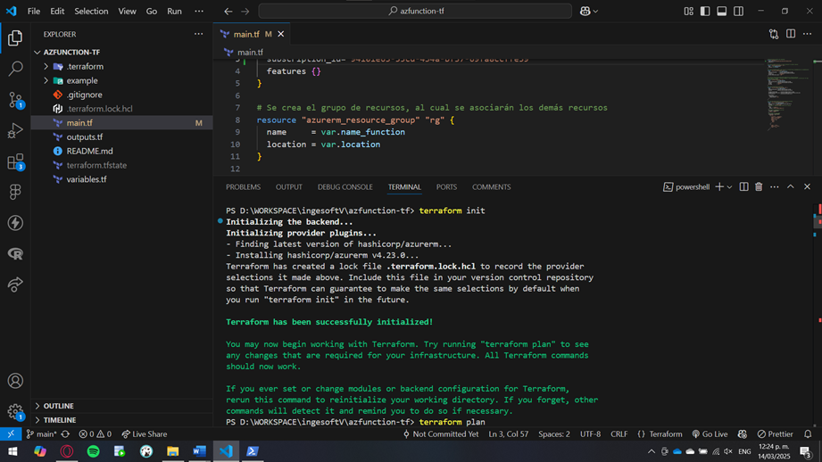
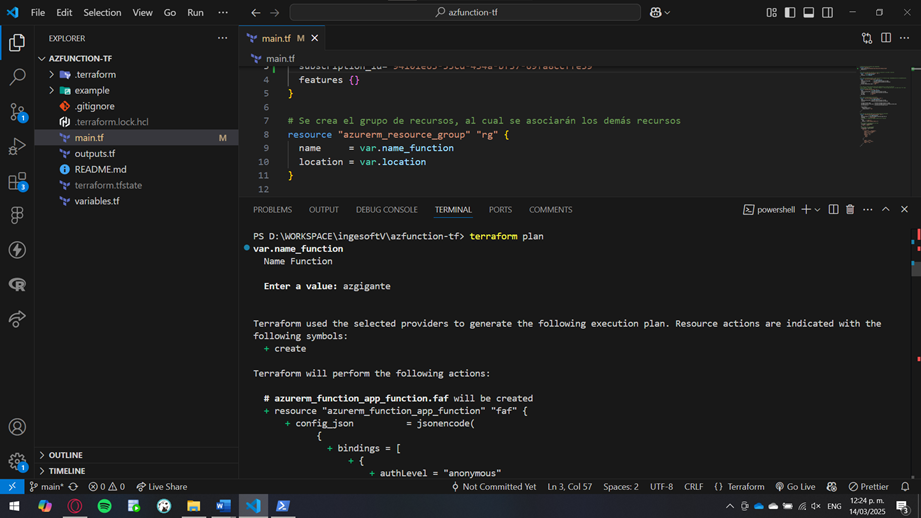
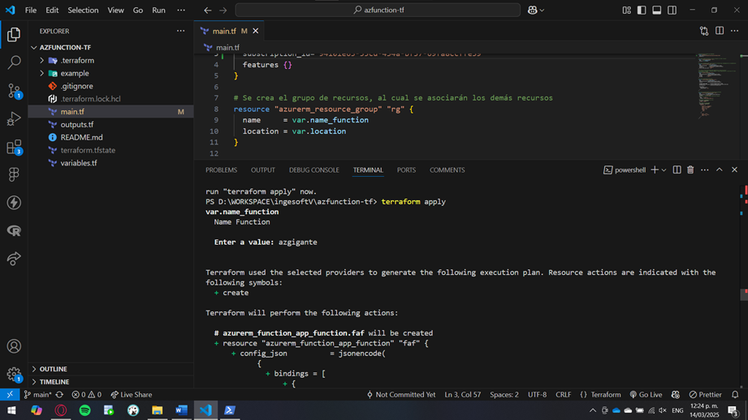
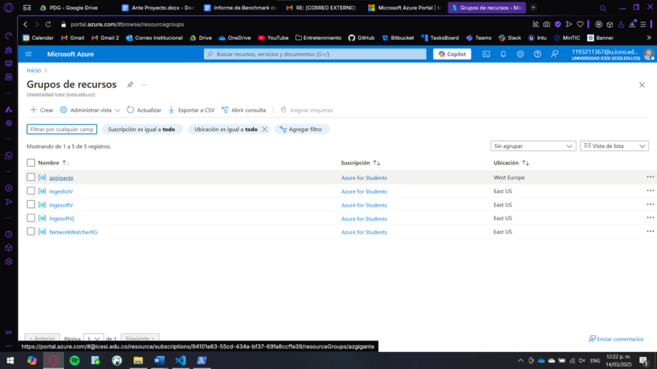
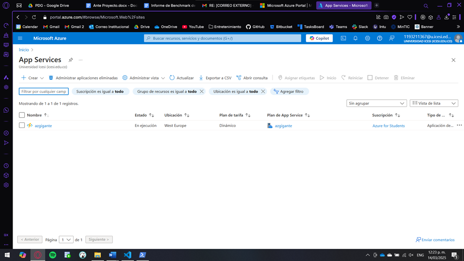
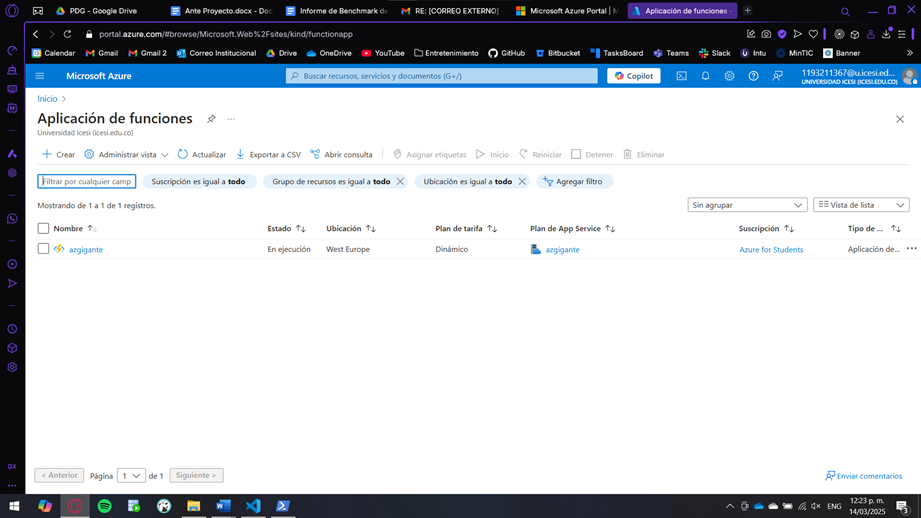
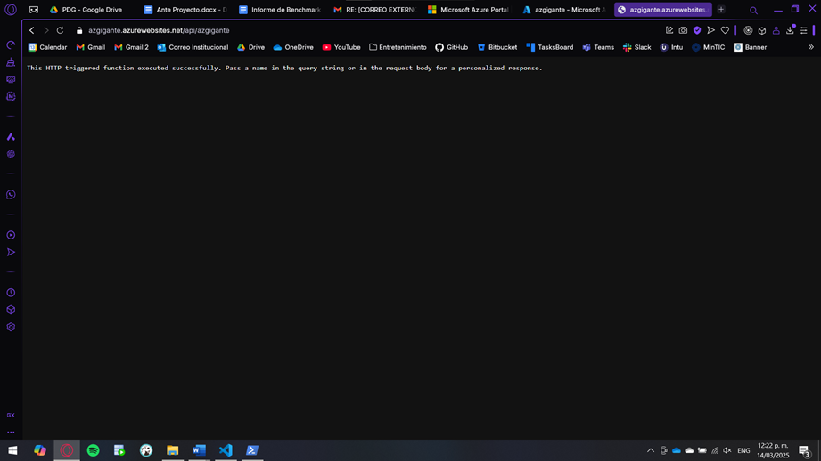

# Terraform Azure Function Workshop

Este taller tiene como objetivo desplegar una **Azure Function** utilizando **Terraform**. A continuación, se detallan los pasos clave para la configuración y despliegue de la infraestructura.

## By

Yuluka Gigante Muriel

---

## Inicialización del proyecto

Para comenzar, se inicializa el directorio de trabajo con Terraform ejecutando:

```bash
terraform init
```

Este comando descarga los proveedores necesarios y prepara el entorno para la gestión de la infraestructura en Azure:



## Planificación de la infraestructura

Antes de aplicar los cambios, se verifica la infraestructura detallada en el código con:

```bash
terraform plan
```

Este comando permite revisar qué recursos se crearán o modificarán sin realizar cambios reales en Azure, y ver si hay algún problema con estos:



## Despliegue de la infraestructura  

Si todo es correcto, hay que aplicar la configuración para desplegar la **Azure Function** y los recursos asociados ejecutando:

```bash
terraform apply
```  

Esto se debería ver así:



## Verificación en el portal de Azure  

Una vez finalizado el despliegue, se puede acceder al **Portal de Azure** y revisar que los recursos se han creado correctamente:








## Comprobación del funcionamiento de la Azure Function  

Si todo está en orden, se puede probar la **Azure Function**. Esto puede hacerse desde el **Portal de Azure**:



La función esta desplegada y retornando de forma correcta :-)